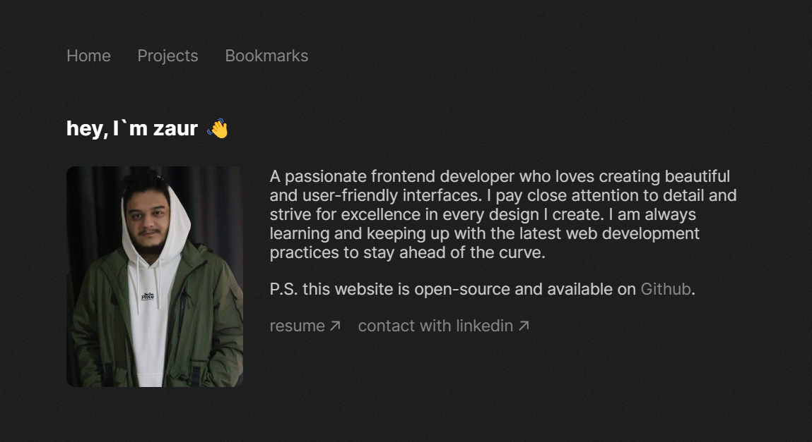

# Zaur Sharifov



Portfolio website to showcase your projects and bookmarks. Built with Next.js, CSS, Framer Motion and HygraphCMS. View the live site. About permissions see MIT License here.

## Getting Started

Clone the repository:

```
git clone https://github.com/zeraphosa/www.zaursharifov.com.git
```

Install npm packages:

```
npm install
```

Clone GraphCMS scheme:

```

```

In GraphCMS:

- Create your project, bookmark contents.
- `Click Project settings > Envirements`, copy api link.
- Create .env.local file outside of src folder and add `GRAPHQL_CMS_API = your-api-link`.
- Give permission for public to see contents in `Project Setting > API`
- To build production ready project add `exportTrailingSlash: true` in your next.config.js file

Run this to start project:

```
npm run dev
```
